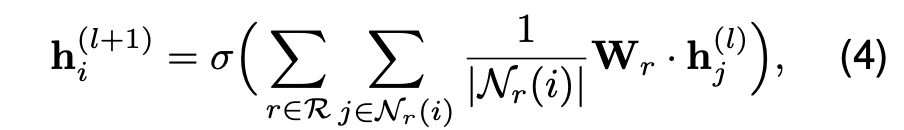

## EventGround: Narrative Reasoning by Grounding to Eventuality-centric Knowledge Graphs

基于事件为中心的知识图谱的叙事推理

作者：Cheng Jiayang（香港大学）

来源：arxiv 2024

论文：[[arxiv](https://arxiv.org/pdf/2404.00209)]

代码：[[github](https://github.com/HKUST-KnowComp/EventGround)]

引用数：1

参考：[]

关键词：知识基础(Grounding)、事件为中心的知识图谱、推理

### 11

时间、事件之间的相互联系。

时间 + 事件。

事件链的链事件更丰富 + chain of thought。

编队里确定中心，输出展示。

数据接口。

体系计算时怎么从redis中/restful接口中接收大量数据，怎么快速接收保存。（直接传对象、对象序列化再传、接送字符串）

定义好其他系统的数据接口。

并行计算。

### 实验结果

数据格式：https://github.com/HKUST-KnowComp/EventGround/blob/main/dataset/StoryClozeTest/raw/val_winter2018.csv

### 摘要

叙事推理依赖于对故事背景中的事件的理解，这需要丰富的背景世界知识。为了帮助机器利用这种知识，现有的解决方案可以分为两组。一些方法专注于通过使用事件感知目标对语言模型（LMs）进行预训练，隐式地建模事件知识。然而，这种方法会破坏知识结构并且缺乏可解释性。另一些方法则明确地将有关事件的世界知识收集到结构化的事件为中心的知识图谱（KGs）中。然而，利用这些知识源进行自由文本的研究仍然存在限制。在本文中，我们提出了一个名为EventGround的初始综合框架，旨在解决将自由文本与事件为中心的KGs联系起来进行情境化叙事推理的问题。我们确定了这个方向上的两个关键问题：事件表示和稀疏性问题。我们提供了简单而有效的解析和部分信息提取方法来解决这些问题。实验结果表明，当与基于图神经网络（GNN）或大型语言模型（LLM）的图推理模型相结合时，我们的方法始终优于基线模型。我们的框架结合了基于知识的知识，实现了最先进的性能，同时提供了可解释的证据。

关键词：知识基础、事件为中心的知识图谱、推理

### introudction

叙事推理（Narrative reasoning），例如预测故事结局和脚本推理。叙事推理依赖于对事件的理解。

考虑以下故事：
“Tom很累，想玩一玩。他买了一张《哈利·波特》的电影票。”
它可以分解成多个子句：
(E1) Tom很累。 (E2) Tom想玩一玩。 (E3) 他买了一张《哈利·波特》的电影票。
其中每个子句都可以视为一个带有动词和一个或多个参数的事件。这些事件被认为是各种NLP研究中的基本语义单位，在其各自的上下文中传达了大部分的含义。

对于人类来说，理解这些语义单位被发现严重依赖于我们的背景世界知识。例如，给定E1和E2，我们可以推断Tom可能刚刚完成了工作。由于我们知道看电影很有趣，所以我们认为Tom选择这样做是合理的（从E2到E3）。我们还可以从E3推理出Tom必须在电影开始前到达剧院。

为了在机器上建模这种世界知识，大多数现有的工作分为两种范式。一种是通过使用事件感知目标对语言模型==（LMs）==进行预训练来隐式地建模事件知识。然而，这种范式在其设计哲学中牺牲了推理的透明度和可解释性。相比之下，另一种范式专注于建模显式的符号事件知识，通常采用==事件为中心的知识图谱（KGs）==的形式，例如ASER。在这个方向上，如何利用这些KGs中的符号事件知识进行推理仍然未被充分探索。这里只有少数研究专注于受限格式（主语-动词-宾语）的文本，无法推广到自由文本。

在本文中，我们向前迈出了一步，研究将自由文本与事件为中心的KGs联系起来进行情境化推理的问题。由于事件具有独特的特征，包括：

1. 表示事件的难度。首先，事件在文本中相互纠缠。它们倾向于与同一上下文中的其他事件共享参数（例如E1和E2）。其次，在从上下文中分离出来时，事件在参数级别上失去了==共指信息==。例如，很难确定事件E3中的代词“他”是否指代E1和E2中的“Tom”。

2. 事件的稀疏性。事件在自然语言中很稀疏。例如，通过添加或删除细节，可以将E3改写为描述相同情景的无限事件，例如“他在线购买了最新的哈利·波特电影票”或“他预订了一张票”。鉴于事件为中心的KGs的不完整性，==将任意事件与KGs匹配的失败率相当高==。

为了解决上述问题，我们提出了第一个明确将自由文本与事件为中心的KGs联系起来的框架。对于事件表示问题，我们将基于语义解析的事件提取与事件规范化模块相结合，将事件从上下文中分离出来，同时保留共指信息。受人类抽象思维过程的启发，我们提出了一种部分信息提取方法来解决稀疏性问题。该方法通过省略参数细节，将事件概念化为多个部分事件。有趣的是，我们在实证上证明这些解决方案显著缓解了稀疏性问题。此外，我们将部分事件与KGs联系起来，以获得联合推理子图。随后，我们采用两种常见的图推理模型来利用这些知识。除了基于图神经网络==（GNN）==的模型外，我们还利用了基于大型语言模型==（LLM）==的模型。在三个叙事推理任务上的实验结果表明，我们的框架始终优于目前的最先进模型。最后，我们提供了一个定性研究，展示了我们的方法如何为模型预测提供可解释的证据。

总之，本文的贡献包括：
1. 我们为将自由文本与事件为中心的KGs联系起来的问题提出了一个初始的公式化。
2. 我们提出了EventGround，一个系统化的方法，解决了事件表示和稀疏性问题，并基于基于知识的信息进行叙事推理。
3. 实验结果表明，我们的方法优于强基线，并在三个数据集上实现了新的最先进性能，同时提供了人类可解释的证据。

### 方法

所提出的事件获取流程包括事件提取、归一化和部分信息提取。

### Obtaining events

#### 事件提取

如前面的例子所示，事件在自由文本中并不是自然存在的。相反，一个事件可能与另一个事件共享参数（例如，E1和E2）或包含另一个事件。因此，需要一个特殊的提取步骤来将事件与其上下文分离。

在这项工作中，我们考虑使用==基于语义解析（动词）==的方法来从上下文中提取事件。对于每一块文本s = [s1, s2, ···, sn]（包含n个句子），我们对文本进行语义角色标注（SRL），以提取一系列以动词为中心的事件P = {p1, p2, · · ·, pm}，其中每个事件pi = (verbi, Ai)包含一个触发词verbi和一组参数Ai。每个参数aij ∈ Ai具有一个语义角色role(aij) ∈ {ARG0, ARG1, · · ·, ARGM}5。此外，我们定义了操作符text(pi)来获取事件pi的文本内容。

#### 事件归一化

值得注意的是，提取的事件存在共指信息丢失的问题。例如，以下是从文本中提取的三个事件：
(1) 将军在聚会上喝了一些酒。(2) 他感到困倦。(3) 他向他们道别。

其中，“将军”和“他”指的是同一个人，而“他们”指的是另一群人。没有上下文的情况下，系统不会意识到这种共指关系。这使得对提取的事件进行推理变得困难。

受到先前工作在构建常识知识图谱方面的启发，我们用特殊标记替换指代人的标记（例如，“[P0]”，“[P0's]”，“[P1]”，其中不同的数字代表不同的人）。例如，“将军”和“他”被替换为“[P0]”，而“他们”被替换为“[P1]”。通过这一归一化过程，共指信息得以保留：
(1) [P0] 在聚会上喝了一些酒。(2) [P0] 感到困倦。(3) [P0] 向 [P1] 道别。

此外，归一化有助于通过去除人名中的细节来减少事件的稀疏性。例如，“将军感到困倦”、“Joe感到困倦”和“他感到困倦”都将被归一化为“[P0] 感到困倦”。这增加了它们成功链接到知识图谱的概率。

#### 部分信息提取

归一化后的事件保留了原始文本中的丰富上下文细节，这对于下游推理过程非常重要。然而，事件的稀疏性可能在事件链接（grounding）方面带来挑战，尤其是当大多数知识图谱（KGs）远未完善时。例如，一个知识图谱更可能包含像“一个人在喝酒”这样的通用事件，而不是“将军在阳台上喝长相思”，因为前者更通用且更可能发生。

人类强烈依赖于概念抽象来识别看似不同概念和事件之间的相似性，这使得我们能够将概括应用于不熟悉的情境。例如，我们可以了解到“买‘复仇者联盟’的票”和“买‘哈利·波特’的票”之间存在共同抽象，以及这种共同性“买票”如何与其他事件（如我们应该“准时到达剧院”）相关联。基于这一概念，我们使用==部分信息提取（PIE）==阶段来获得部分事件作为可控抽象的一种方法。

部分信息提取基于语义角色标注中事件参数的重要性。例如，ARG0和ARG1的重要性最高，因为它们通常指定主语和宾语。相比之下，修饰语参数ARGM表达的是最不重要的信息，

具体来说，我们提出按照事件参数重要性的降序来丢弃这些参数。对于事件p = (verb, A)，其中|A| = k，我们迭代地丢弃其中的参数aj ∈ A，丢弃的参数的角色按照以下顺序进行：（1）ARGM，（2）ARG2, ARG3, ARG4，（3）ARG1 和（4）ARG0。对事件集P进行部分信息提取后，得到一个新的部分事件集Pabs，其中Pabs = {pˆ1, pˆ2, · · · , pˆm}。每个元素pˆi = [p0i, p1i, ···] 是一系列对应于事件pi ∈ P的部分事件序列（p0i = pi）。

以下是一个pˆ的示例：

每次丢弃一个参数，部分事件的抽象程度就增加。同时，抽象程度更高的部分事件（例如p2, p3）更有可能被记录在知识图谱中，这缓解了事件的稀疏性问题。在4.5节中，我们通过实验表明，部分信息提取通过大幅提高事件链接的命中率，从而提高了模型的性能。

### Grounding to eventuality-centric KG

链接到以事件为中心的知识图谱

在本节中，我们将讨论事件链接的方法。在3.2.1中，我们将描述如何将事件映射到以事件为中心的知识图谱中，以获取具有最接近语义含义的锚定事件。在3.2.2中，我们将描述如何基于锚定事件检索链接的子图。

#### 事件映射到以事件为中心的知识图谱

假设我们有一个以事件为中心的知识图谱 G = (V, E)，其中 V 是节点集，E 是边集。每个节点 vi ∈ V 是一个事件，并且具有一个文本属性 text(vi)。然后，对于每个部分事件 p ∈ Pabs，我们的目标是找到知识图谱 V 中的节点 v（我们称之为“锚定事件”），该节点与 p 最为相似。

为了定义事件的相似性，之前的工作已经探索了基于TF-IDF或BM25向量的余弦距离来计算词级相似性。然而，这种方法忽略了事件的语义，并经常错误地将具有高逆文档频率的术语的事件进行匹配（例如，“[P0]的肺部被击中”与“[P0]患有肺癌”相匹配）。因此，我们转向使用==语义相似性==来匹配事件。

具体来说，我们使用sentence transformers对事件p和v进行编码，并通过L2距离来计算d(p, v)：

在实践中，并不是每个事件都能成功与正确的事件进行匹配。我们经验性地设定了一个阈值l来过滤掉d(p, v)超过该阈值的失败匹配。结果，Pabs中的部分事件与G中的锚定事件进行了匹配，我们用C来表示这些匹配。C = {cˆ1, cˆ2, ..., cˆm}，其中每个cˆi是从pˆi中匹配到的一系列锚定事件。

这种方法通过考虑事件的语义信息，提高了事件匹配的准确性，并减少了由于逆文档频率高而导致的错误匹配。通过设定阈值l，我们可以进一步控制匹配的质量，只保留那些足够相似的事件对。

#### 基于锚定事件检索链接的子图（Joint subgraph construction）

基于3.2.1节中匹配结果得到的锚定事件，我们的目标是从知识图谱G中检索一个子图G_{sub} = (V_{sub}, E_{sub})。理想情况下，G_{sub}应该包含与推理相关的背景世界知识，同时包含尽可能少的额外事件。然而，找到这样的子图本质上是一个NP完全的Steiner树问题（Garey和Johnson，1977；Lin等人，2019），这是一个难以处理的问题。

作为一种折中方案，我们在中的每对事件之间搜索γ跳（hop)内的最短路径。对于找到的任何路径，路径上的节点和边都被添加到G_{sub}中。（匹配到了取k跳子图）

**联合子图构建**：基于G{sub}，我们为推理构建了一个联合知识增强的子图G_{joint} = (V_{joint}, E_{joint})。具体来说，G{joint}包括G{sub}中的所有节点和边。此外，我们将上下文事件P作为节点添加到G_{joint}中，并将它们与锚定事件C之间的链接关系以及上下文中的事件之间的顺序关系（即它们在上下文中出现的顺序）作为边添加到G_{joint}中。

### Graph reasoning models

检索到的子图随后被用于推理，这可以通过基于图神经网络（GNN）的推理模型或基于大型语言模型（LLM）的推理模型来实现。以下是基于GNN的推理模型的描述：

**GNN**

首先，我们使用语言模型表示对文本s和节点v ∈ V

接着，我们采用GNN模块在联合子图G_{joint}上进行推理。我们选择关系图卷积网络（RGCN），以便能够很好地建模G_{joint}中的关系信息。具体来说，在一个L层的GNN中，对于每一层l，节点i ∈ V_{joint}的表示h^{(l)}通过以下方式更新：

其中R是E_{joint}中边类型的集合，N_r(i)表示节点i的关系r的邻居节点集合，σ(·)是非线性激活函数。然后，我们通过从最后一层聚合隐藏节点嵌入来获得G_{joint}的向量表示：

最终预测来自以下公式：

其中MLP表示多层感知机模块，用于预测输出的概率。

通过这种方式，基于GNN的推理模型能够利用G_{joint}中的结构和关系信息，以及文本s的语义信息，来做出最终的预测。

**基于大型语言模型（LLM）的推理模型**。我们也探索了将事件知识子图G{joint}融合到LLMs中。由于LLMs只接受序列输入，我们需要对子图进行序列化，以类似于（Madaan和Yang，2021；Sakaguchi等人，2021）的格式。通过使用转换函数t(·)，子图G{joint}被转换为一个文本片段s_{Gjoint}（s_{Gjoint} = t(G_{joint})），然后将其作为提示的一部分输入到LLM中。（子图变成序列）

关于转换函数t(·)的不同变体以及其他细节，我们将在第4.3节中讨论。转换函数t(·)的目标是生成一个能够保留G_{joint}中关键结构和信息的文本序列，这样LLM就可以利用这些信息进行推理。可能的转换方法包括遍历图并生成描述节点和边的文本，或者使用更复杂的图嵌入和序列生成技术。

在LLM的推理过程中，生成的文本s_{Gjoint}将与其他文本输入（如查询或背景知识）一起作为提示输入给LLM。LLM将基于这些提示进行推理，并生成相应的输出。这种方法可以使得LLM能够利用事件知识子图中的结构化信息来增强其推理能力。